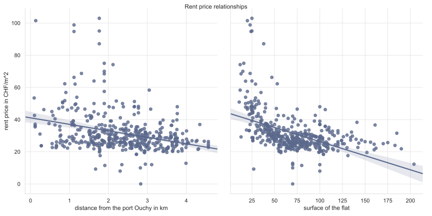

---
# Feel free to add content and custom Front Matter to this file.
# To modify the layout, see https://jekyllrb.com/docs/themes/#overriding-theme-defaults

---

Finding an apartment in Lausanne with a rent that fits a student budget is a
time-consuming and tedious task. If you have just arrived in Lausanne, you don't
know where to look. Is it cheaper on the hill or near the university? You don't
know all the parameters that come into play and while running from one flat
viewing to another you start to wonder: who owns all this real estate you would
like to live in?

#### Goal

We want to bring some light into the opaque world of real estate. By leveraging
openly accessible data our goal is to understand **how rent prices are
influenced by the type of the owner, the geographical situation, or other
factors**. This article should serve as a head start for people searching
affordable rents in Lausanne.

#### Key insights

In particular you will be enlightened by the following real estate insights
and you will understand how these were obtained. Even if Lausanne is not
New York we needed to think of it in smaller units. Therefore, our results
divide the city into its neighbourhoods – in french
[_quartiers_][quartiers_lausanne].

- The owner with the most parcels in Lausanne is the municipality.

- The _quartiers_  _Montriond_ and _Ouchy_  are clearly more expensive
  than the rest.

- The city centre is mostly owned by corporations,
  _Chailly_ is mostly owned by privates.

- There is no direct relation between owner type and prices. The market seems to
  adjust prices uniformly over the ownership types.

- The price per square meter of a flat is strongly influenced by the distance to the
  _lac Léman_ and by the surface of the flat. Smaller flats cost more
  per square meter than large flats.



Our first [dataset][asit] consists of the geographical, [cadastral] and address
data behind [map.lausanne.ch](https://map.lausanne.ch). It features the owner of
each of the almost 8000 plots or parcels (of land) in Lausanne.
There are about 4000[^1] entities possessing
real estate and they are as diverse as you would imagine them, ranging from the
municipality, to private people, to even multinational companies like Crédit
Suisse, Phillip Morris International or the pension fund of Swatch.

[^1]:  
    This number does not account for PPE (_prorpiété par étage_). If a house's
    flats are owned by individuals the dataset does not distinguish the
    different owners. It just indicates PPE.

#### Ownership types

The owner with the most parcels is unsurprisingly the **city of Lausanne**. With
1265 parcels it owns 12% of all parcels. This is ten times more than the next
two owners which are the pension funds of the city and of the canton Vaud.
Because most owners only have a small amount of parcels we will group them into
7 types:

{: .owner-legend }
 - {: .public } public institutions: _the city, the swiss railways etc._

- {: .pension } pension or similar funds: _investment foundations, the city's
  pension fund, etc._

 - {: .corp } corporations: _listed public companies like Swiss Life S.A., Régie
  Chamot & Cie S.A. etc._

 - {: .coop } cooperatives: _registered cooperative companies like Migros, la
  Mobilière etc._

 - {: .foundation } foundations and associations: _for example the olympic foundation for
    cultural heritage._

 - {: .ppe } PPE: _single flats in a building owned by different private people
 -- in french_ proriété par étage.

 - {: .private } individual privates: _private citizens owning an entire building._

If we look at the data as a map a very noisy mosaic shows up.

<iframe src="assets/export/by_owners_all_in_one.html"></iframe>

#### Denoising

If you just squinted while looking at the map, we have the same intuition. The
mosaic is too chaotic to say anything. Therefore, we try to smoothen the picture
–  digitally. For each parcel we drew an imaginary circle through its
neighbouring parcels and looked at their ownership type. The cell was then
reassigned to the type which covered the most of the circle's surface. This can
be seen as a weighted [k-nearest-neighbours] algorithm with variable _k_. (Click
on the legend of the above map to see the second layer.)

With this cleaner picture, some patterns emerge. The eastern _quartier_
_Chailly_ is dominantly owned by privates. Big parks, the lakeside and the rail
lines are of course possessed by public institutions and the centre of the city
has the highest density of corporations.

#### Diversity

The fact that the two maps are different shows that there is a lot of diversity
in some _quartiers_' ownership patterns. In order to see which _quartiers_ are
the most diversely owned, we computed another map that measures the diversity
with the [Shannon entropy] of the owners in a circle around each parcel.

<iframe src="assets/export/entropy_owners.html"></iframe>

Unsurprisingly, the large parks, the airport and the lakeside which all belong
to the city have low  entropy in their ownership patterns. That means there is a
local monopoly of owners. While this was expected for the city's properties it
is rather a discovery for the [_Flon_] in the centre of the city. This area is
red as well because a single corporation (_LO Immeubles S.A._) owns all of the
properties in the _Flon_!



If you visit a real estate portal you see something like
[this][homegate_example]. You don't get a global view of the area and its
prices. To overcome this, we collected the listings from the three most
important swiss platforms ([Anibis](https://www.anibis.ch/),
[Homegate](https://www.homegate.ch/) and [Tutti](https://www.tutti.ch/)). After
removing duplicates and fake offers this gave us 469 offers with prices in
CHF/m2. By combining them with our geographical data from before, we
can present them in the map below.

#### Extrapolation

These points don't really help if one needs information for a property
between two points. Therefore, you find the second map that features the median
rent price for each _quartier_. (Click on the second layer of the map.)

We were still not satisfied by this second map, because it averages out all
fine-grained information. The  [k-nearest-neighbours] algorithm seemed like the
perfect match for the problem. (And not _only_ because of its name.) By looking
at the nearest neighbours of a parcel we predict its rent price. This allows us
to get a smooth heat-map of rents in Lausanne which is displayed as the third
layer below:

<iframe src="assets/export/by_rents_all_in_one.html"></iframe>

There seem to be two hot spots for high rents: the city centre and even more
significantly the two _quartiers_ near the lake and the port _Montriond_ and
_Ouchy_. For our student readers, the affordable rents are more on the hill, for
example near the airport.



#### Ownership influence

Having seen the differences in ownership across the city, we ask ourselves
whether the ownership type also influences the price of accommodation. To give a
statistically correct answer, we evaluated a simple linear model with
[linear regression]. The model tries to find significantly different mean rent
prices depending on the ownership type of a parcel.
This model however does not give a meaningful result. It seems like our
hypothesis that rents are different if the property is for example owned by a
corporation has no factual basis, and that the small differences in the mean
rents of each ownership type just arise from random noise. After all,
we only have a small number of offers compared to the number of parcels.

#### Geographical factors

But if the owner doesn't influence the price, what does? Why are prices
different? You can get an intuition for this by looking at the smoothed rent
map. Clearly, the parts near the lake are more red. Our next linear regression
therefore analyses the dependence of the price on the distance to the port of
Lausanne, [_Ouchy_]. As you can observe in the plot to the left, there is a
visible correlation. Our model can confirm with a high significance that the
more you go towards the country-side, the cheaper flats get.

There is also a second factor that influences rent prices per square meter. This
aspect is less obvious: the surface of the flat inversely correlates with the
price per square meter. From the plot one can see that small flats
have a very high price per square meter.



Even if we did not exactly find what we set out to find, we learned quite a bit
about rent prices and _quartiers_. Our first hypothesis that rent prices are
influenced by the owner was rejected. We see two reasons for this: First, we
only had sparse data about rents. The circa 500 offers we collected only cover a
small percentage of rental units in Lausanne.

The second and more important reason is the market. By the law of supply and
demand prices will always balance one another. Put in other terms, no owner will
offer their property at a higher price than the neighbours because this would be
an economical disadvantage. Similarly, if all neighbours offer their real estate
at a high price the owner will do the same. This demonstrates the importance of
the _quartiers_ or in general the geographical situation that we showed was a
significant factor for the price.

As students at [EPFL](https://www.epfl.ch/) we know how hard it is to find
accommodation in Lausanne. We hope that this analysis helped you understand
where to look for a flat and what parameters determine the prices across the
city. This projects also shows the potential of open data for providing
transparency and insight into otherwise opaque systems. We can only encourage to
do the same for other  things that interest you![^2]

[^2]: All images are from [wikimedia commons](https://commons.wikimedia.org/wiki/Category:Lausanne).

[_Ouchy_]: https://map.geo.admin.ch/?lang=en&topic=ech&bgLayer=ch.swisstopo.pixelkarte-farbe&layers=ch.swisstopo.zeitreihen,ch.bfs.gebaeude_wohnungs_register,ch.bav.haltestellen-oev,ch.swisstopo.swisstlm3d-wanderwege&layers_visibility=false,false,false,false&layers_timestamp=18641231,,,&E=2537733&N=1150883&zoom=7.498594761554026&crosshair=marker

[_Flon_]: https://map.geo.admin.ch/?lang=en&topic=ech&bgLayer=ch.swisstopo.pixelkarte-farbe&layers=ch.swisstopo.zeitreihen,ch.bfs.gebaeude_wohnungs_register,ch.bav.haltestellen-oev,ch.swisstopo.swisstlm3d-wanderwege&layers_visibility=false,false,false,false&layers_timestamp=18641231,,,&E=2537831&N=1152550&zoom=7.896666666666668&crosshair=marker

[Shannon entropy]: https://en.wikipedia.org/wiki/Entropy_(information_theory)
[linear regression]: https://en.wikipedia.org/wiki/Linear_regression
[k-nearest-neighbours]: https://en.wikipedia.org/wiki/K-nearest_neighbors_algorithm
[asit]: https://www.asitvd.ch/chercher/catalogue.html?view=sheet&guid=486&catalog=main&type=complete&preview=search_list
[cadastral]: https://en.wikipedia.org/wiki/Cadastre
[homegate_example]: https://www.homegate.ch/rent/real-estate/city-lausanne/matching-list?tab=list&o=sortToplisting-desc
[quartiers_lausanne]: https://www.lausanne.ch/en/officiel/statistique/quartiers/presentation-des-quartiers.html
[_zones foraines_]: https://www.lausanne.ch/en/officiel/statistique/quartiers/presentation-des-quartiers/90-zones-foraines.html
